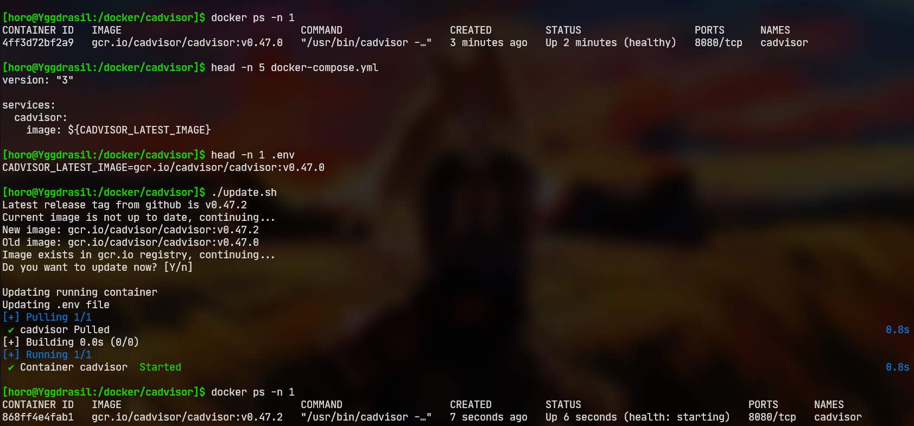

# cAdvisor latest/stable updater



This script will check if there is a new version of cAdvisor available and update the `.env` file with the new image tag.

## The issue
**This shouldn't need to exist**, 😅 
but because the latest tag of the cAdvisor project is not updated on gcr.io... (see https://github.com/google/cadvisor/issues/3066)

Which means that all `docker-compose` files that use the latest tag, get an outdated version from late 2020... 

So if you thought something like:
> "I should use the latest tag so I get updates and don't have to worry about running an old version - with potential security issues..." 

You thought wrong... So did I 😅 🤦‍♂️ - down the drain with my automated pre-update snapshot + Watchtower update system 🤣.

So all that leads to the need for a manual update every time a new version of cAdvisor is released ... and all the implications that come with it, like even noticing that a new version is available...

## Solution (Workaround)
I wrote a small script that cross-references the latest (stable) release of cAdvisor on github (https://github.com/google/cadvisor) with the corresponding image on gcr.io and updates if necessary.

The image (with tag) is stored in a `.env` file and is used in the `docker-compose` file.
So the script basically just updates the `.env` file and then runs the normal `docker-compose up -d` command.

Most of the code is just sanity checks to ensure that nothing unexpected has changed (and if it has, it does nothing and exits with an error message).

## Installation
You can just clone this repo and run the `updater.sh` script from where your `docker-compose.yml` file is.

In your `docker-compose.yml` file you need to change the image variable to this:
```yaml
image: ${CADVISOR_LATEST_IMAGE}
```

This variable is provided by the `.env` file.

### Example
```bash
cd /docker/cadvisor # where your docker-compose.yml file is
git clone https://github.com/HoroTW/cadvisor-latest-stable-updater
# just to show how the files are structured
# $ tree -a -L 2
# .
# ├── cadvisor-latest-stable-updater
# │   ├── .env.example
# │   ├── .git
# │   ├── LICENSE
# │   ├── README.md
# │   ├── Screenshot.png
# │   └── updater.sh
# ├── docker-compose.yml
# └── .env

# run the updater:
# $ bash cadvisor-latest-stable-updater/updater.sh
# Latest release tag from github is v0.47.2
# Current Image is already the latest - no need to update.
```

## Usage
```bash
./updater.sh [-y] # -y: update without confirmation
```

## Requirements
The updater needs root or will ask for sudo permissions because in my case the .env is not writable by a normal user.

Of course you can change that if you don't like this behavior.

---
Happy updating 😁
